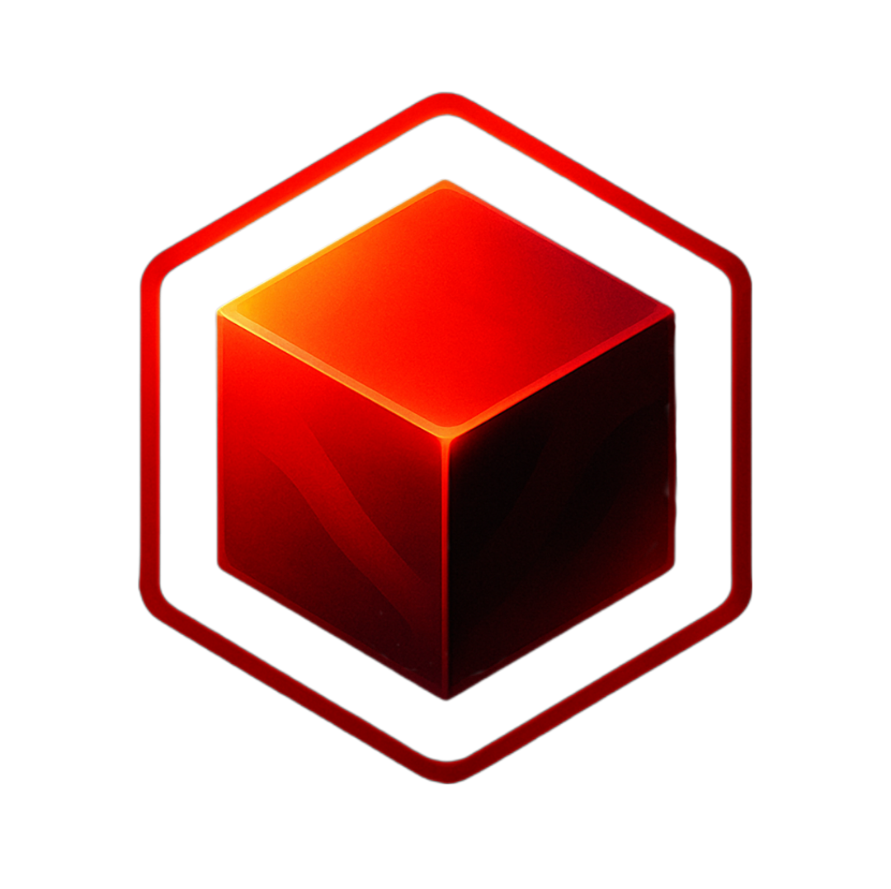
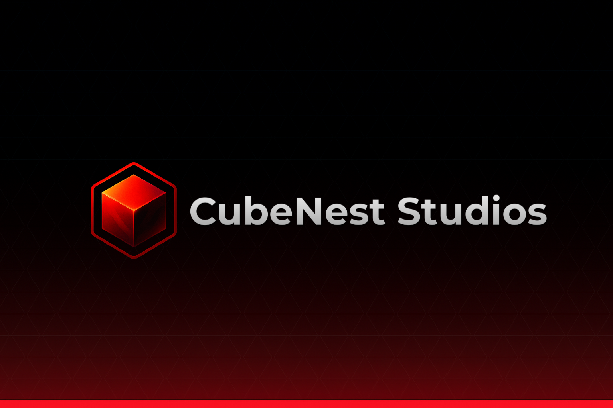

<table>
<tr>
<td align="center" width="140">

</td>

<td align="left">

# CubeNest Studios

Modern Minecraft araçları geliştiren bağımsız bir stüdyo.  
Oyuncular, geliştiriciler, içerik üreticileri ve tasarımcılar için güçlü araçlar oluşturuyoruz.

 

</td>
</tr>
</table>

 

---

# About CubeNest Studios

CubeNest Studios is an independent organization focused on building modern tools for the Minecraft community.

Preparations for the project started in mid-2025, development plans continued until early 2026, and the organization was officially announced on **February 14, 2026**.

Our first project, **CubeNest**, aims to simplify the Minecraft experience for:
- Players
- Developers
- Content creators
- Designers

Even though the project is still new, we continue to actively improve the platform by releasing updates and developing new tools for the community.

After CubeNest reaches a full stable release, we also plan to begin development on future projects under CubeNest Studios.

---

# CubeNest

CubeNest is a multi-tool platform developed specifically for the Minecraft community.

Currently available tools:

---

## Server Status

Monitor Minecraft Java & Bedrock servers instantly.

### Features
- Online player count
- Ping information
- Server details
- Quick access to the 3 most popular servers

---

## Player Viewer

Advanced Minecraft Java player viewer.

### Features
- 3D skin preview
- UUID lookup
- Download skins
- Head command generator
- Quick access to popular player tags

---

## Manifest Creator

Generate Minecraft Bedrock `manifest.json` files easily.

### Features
- Automatic JSON generation
- Simple interface
- Fast manifest creation
- Ready-to-use output

---

## Glyph Mapper

Visualize and copy Bedrock glyph fonts easily.

### Features
- Upload `glyph_XX.png`
- Preview glyph characters
- One-click copy support
- Resource pack compatibility

---

# Planned Tools

- Motd Editor
- Circle Generator
- Enchantment Calculator

---

# Technologies

---

# Team

| Member | Role |
|---|---|
| **xFrightfull** | Founder • Lead Developer |
| **DustFluffyDev** | Co-Founder • Lead Developer |

---

# Links

 

[GitHub](https://github.com/CubeNestStudios) •
[Website](https://cubenest.xyz/) •
[Discord](https://cubenest.xyz/discord/)

---

